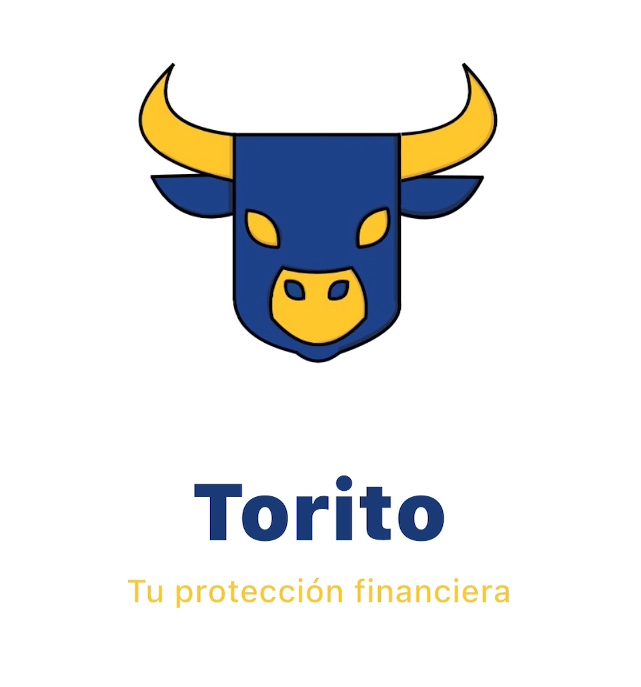
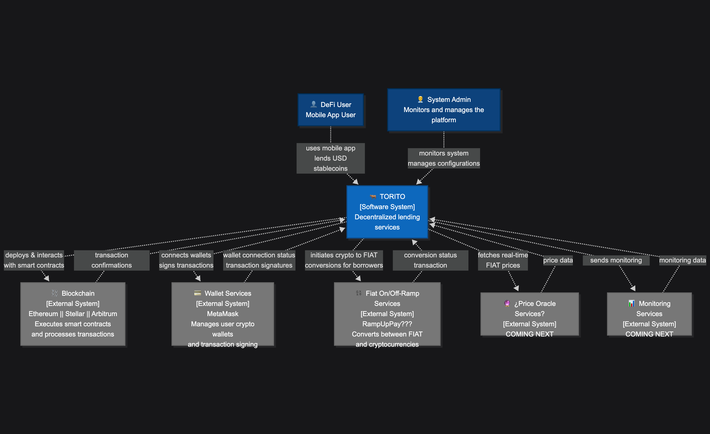
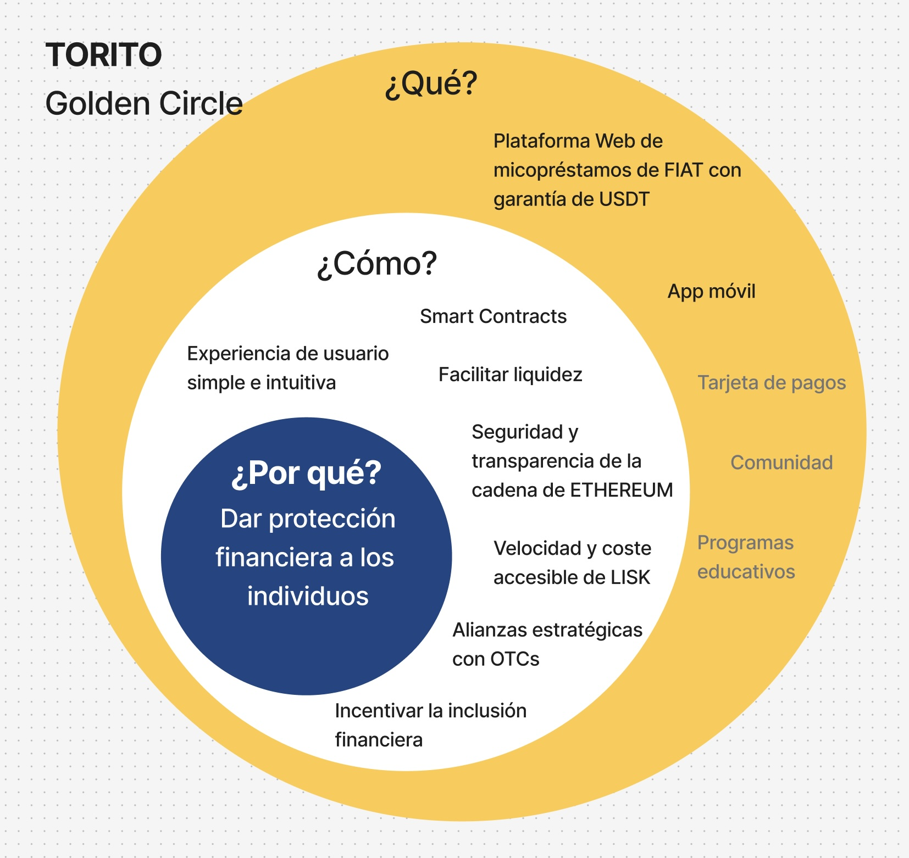

# Torito: Cross-Border Lending Protocol

## Overview

Torito is a decentralized lending protocol enabling users to deposit USDT and borrow up to 50% of its value in local FIAT currency at competitive exchange rates. Built on Optimism and LISK for speed and affordability, Torito leverages Morpho vaults for protocol profitability and to fund strategic OTC alliances, who pay FIAT directly to users' bank accounts.

## Features

- **Connect Wallet:** Securely connect your EVM wallet to manage deposits and loans.
- **Deposit USDT:** Instantly deposit USDT; funds are managed by Torito for protocol yield and OTC payouts.
- **Lending Visualization:** Real-time calculation of borrowable FIAT based on current exchange rates.
- **Borrow FIAT:** Access up to 50% of your USDT deposit in local currency, with dynamic interest rates. FIAT is paid out by OTC partners directly to your bank account.
- **Repay & Liquidate:** Repay loans with interest; collateral is liquidated if health factor drops. Users are notified when their loan repayments are received and processed.
- **Admin Controls:** Protocol owner can manage supported tokens, currencies, and oracles.

## How It Works

1. **Deposit USDT:** Users deposit USDT, which is managed by Torito for yield and OTC liquidity.
2. **Borrow FIAT:** Users borrow FIAT against their USDT collateral, up to 50% of its value. FIAT is paid out by OTC partners to users' bank accounts.
3. **Interest & Repayment:** Loans accrue interest; users repay to unlock collateral. Users are notified when repayments are received.
4. **Liquidation:** If collateral value falls, loans are liquidated to protect the protocol.

## Smart Contracts

- **Torito.sol:** Manages deposits, borrows, repayments, and liquidations. Integrates with Morpho for protocol yield and PriceOracle for exchange rates.
- **PriceOracle.sol:** Provides up-to-date currency prices for accurate FIAT lending calculations.

## Tech Stack

- **Frontend:** Next.js, React, Tailwind CSS, TypeScript
- **Smart Contracts:** Solidity, OpenZeppelin, Morpho vaults
- **Blockchain:** LISK Mainnet
- **Testing:** Hardhat, Typechain, Ethers.js

## Why LISK?

- **Low Fees:** Enables micro-lending and affordable transactions.
- **Fast Confirmations:** Ensures a seamless user experience.
- **Scalable:** Supports high transaction volumes for global lending.
- **Superchain Compatibility:** LISK is part of the Optimism Superchain ecosystem, enabling seamless interoperability, shared security, and future-proof scalability for cross-chain DeFi applications.

## Architecture

## ¿Would this work long term?

- **Built for Sustainability:** Torito leverages the enduring economic power of the US dollar, providing a stable foundation for lending.
- **Empowering Emerging Economies:** Users in countries like Bolivia, Argentina, Venezuela, Nigeria, and Turkey gain access to USD-backed loans, offering a financial lifeline during local economic uncertainty or crisis.
- **Profitable Model:** The protocol is architected for long-term profitability for Torito and its strategic partners, ensuring business viability and growth.
- **Reliable Access to FIAT:** Users benefit from fair exchange rates and direct FIAT payouts to their bank accounts, even in challenging environments.
- **Resilience Against Inflation & Devaluation:** Especially valuable for regions facing inflation, currency devaluation, or limited access to global financial services.
- **Community Empowerment:** Torito enables individuals and communities to leverage USD stability, supporting financial inclusion and resilience.

---

## Why do we exist?

Torito exists to empower individuals and communities in emerging economies by providing reliable access to USD-backed financial services. We believe in financial inclusion, resilience, and the transformative power of decentralized technology to create lasting impact.

---

**Try Torito today and experience the future of decentralized lending!**